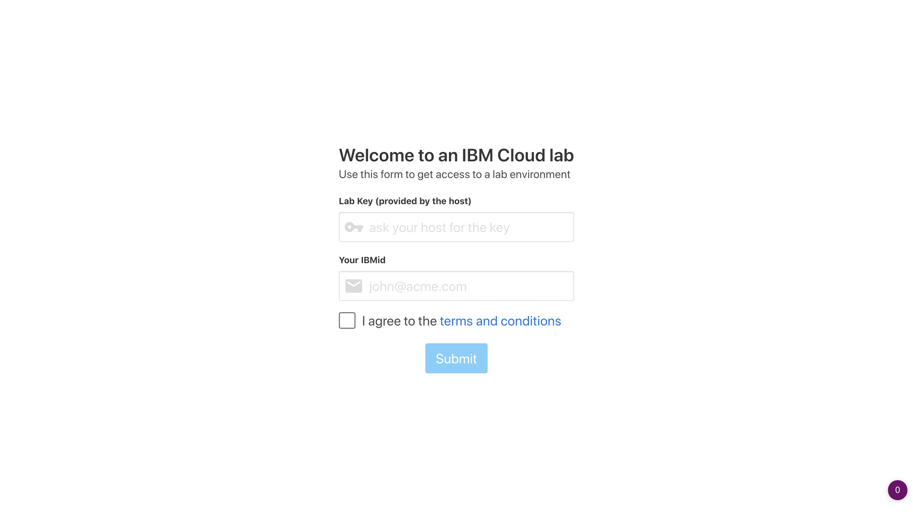
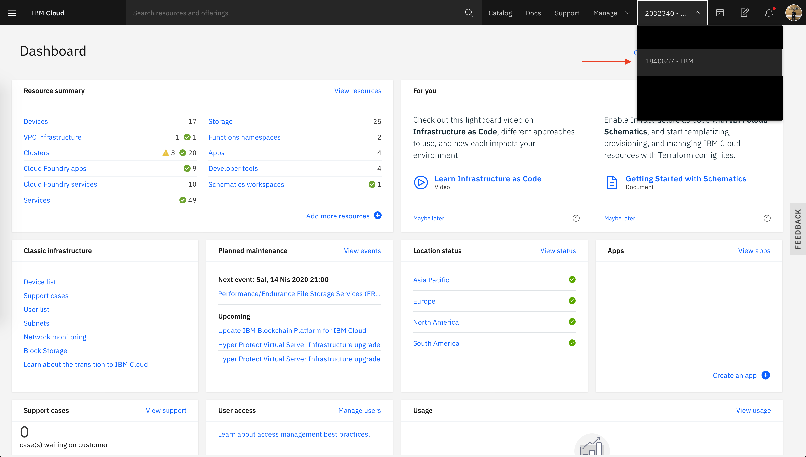

# Get preCreated Kubernetes Cluster

## Go to URL Given by Instructor

1. Fill **Lab Key** input with the key instructor gives you.
2. Fill **Your IBMid** input with your IBM Cloud email address.

When you switched your account, click to **View resources** button and open **Clusters** section to see your claimed Kubernetes Cluster.

